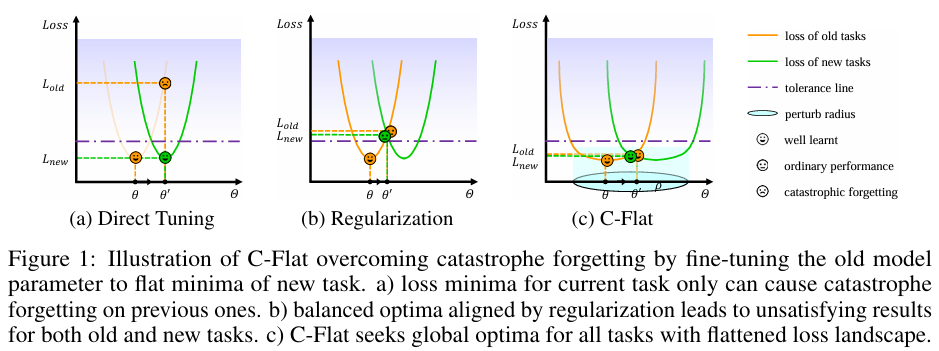
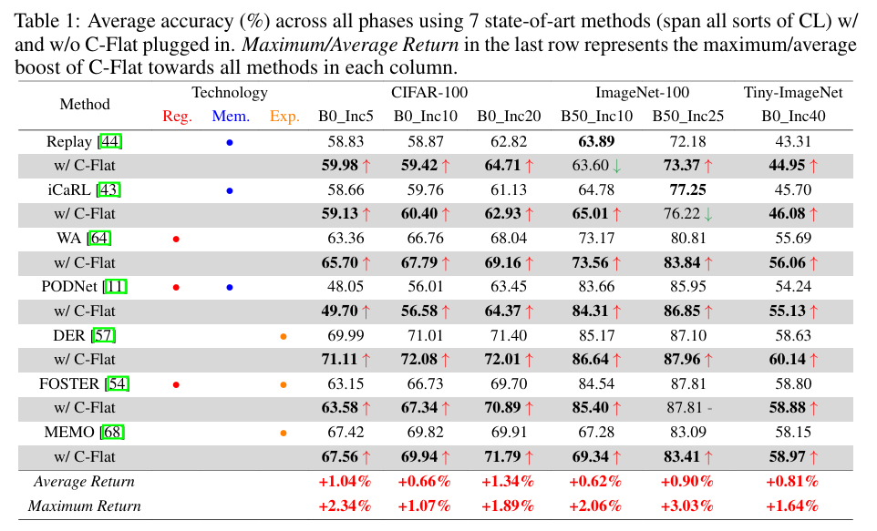
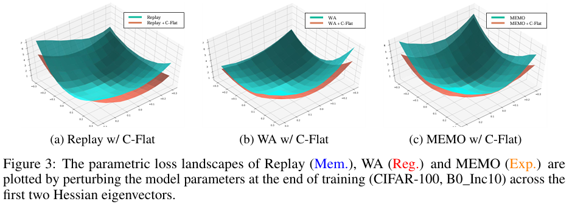

# C-Flat

This repo contaions the official implementation of the NIPS2024 paper "Make Continual Learning Stronger via C-Flat" [[paper](https://openreview.net/pdf?id=Dokew2u49m)].

## Acknowledgment
This repository is partially based on [PyCIL](https://github.com/G-U-N/PyCIL) and [GAM](https://github.com/xxgege/GAM).

## Prerequisites
This code is implemented in PyTorch, and we have tested the code under the following environment settings:
- python = 3.9.13
- torch = 2.0.1
- torchvision = 0.15.2

## Algorithm and results




## Usage
Step 0:  Datasets

We provide the source code on three benchmark datasets: CIFAR-100, ImageNet-100, and Tiny-ImageNet. For CIFAR-100, it will be downloaded automatically upon first use. For the other two datasets or self-made datasets, please modify the corresponding path in `utils/data.py`.

Step 1:  Quick start

+ Train CIFAR-100 on [WA](https://arxiv.org/abs/1911.07053) with C-Flat
```
python main.py --config=exps/wa.json --cflat
```
+ Train CIFAR-100 on WA without C-Flat
```
python main.py --config=exps/wa.json
```

For other detailed model configurations, please refer to `exps/[model_name].json`.

Step 2:  Custom application

2.1 Create a closure to calculate the loss
```
def create_loss_fn(self, inputs, targets):
    def loss_fn():
        logits = self._network(inputs)["logits"]
        loss_clf = F.cross_entropy(logits, targets)
        return logits, [loss_clf]
    return loss_fn
```

2.2 Introduce the cflat optimizer
```
optimizer = C_Flat(params=self._network.parameters(), base_optimizer=base_optimizer, model=self._network, cflat=True)
```

2.3 Model update
```
loss_fn = self.create_loss_fn(inputs, targets)
optimizer.set_closure(loss_fn)
logits, loss_list = optimizer.step()
```

## Citation

If you find this repo useful for your research, please consider citing the paper.

```
@article{bian2024make,
  title={Make Continual Learning Stronger via C-Flat},
  author={Bian, Ang and Li, Wei and Yuan, Hangjie and Yu, Chengrong and Zhao, Zixiang and Wang, Mang and Lu, Aojun and Feng, Tao},
  journal={arXiv preprint arXiv:2404.00986},
  year={2024}
}
```
## Contact

If there are any questions, please feel free to contact the corresponding author: Tao Feng (fengtao.hi@gmail.com).

